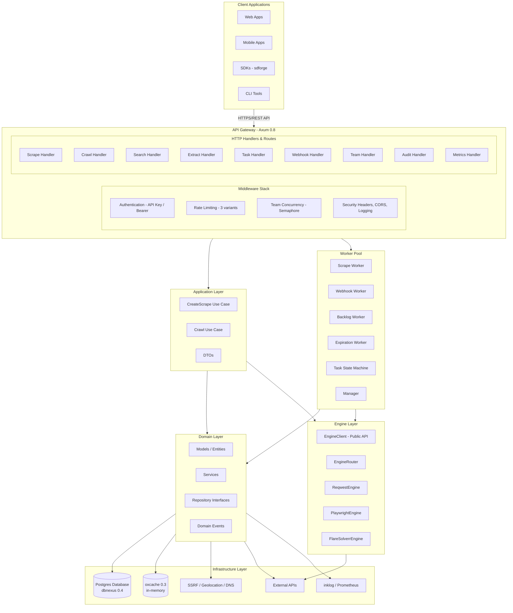
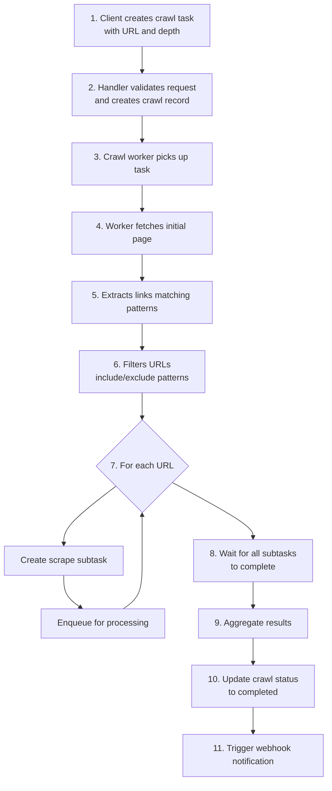
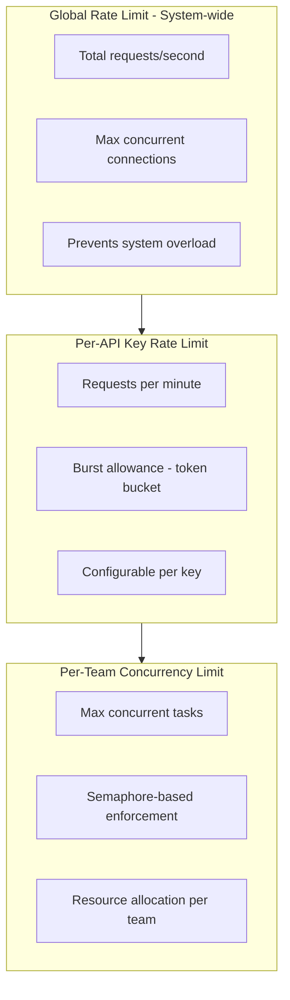
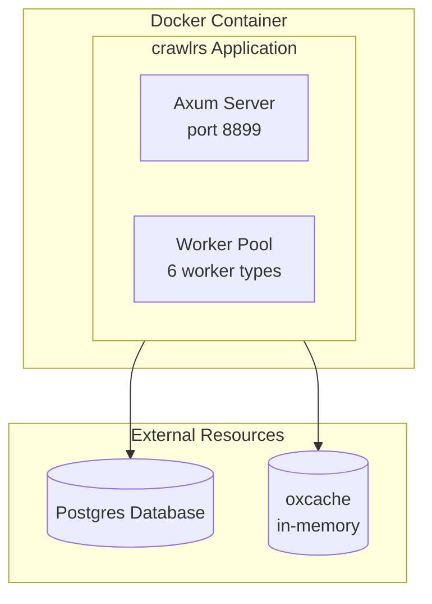
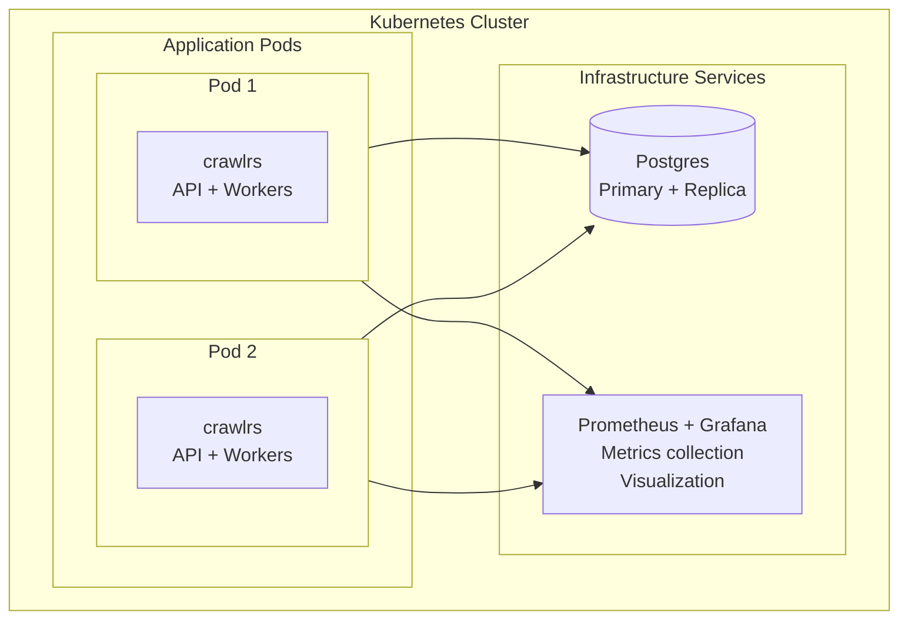
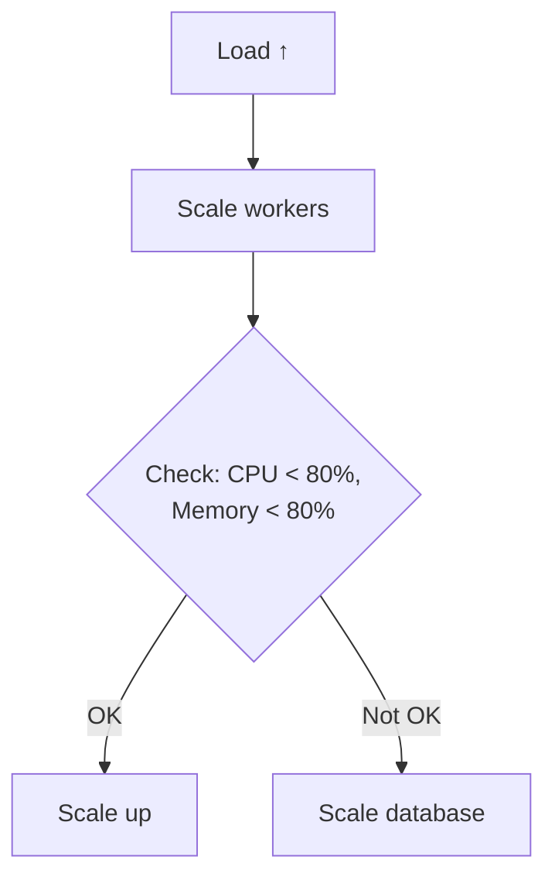

# System Design & Technical Architecture

<div align="center">


**Version:** 0.1.0 | **Last Updated:** 2025-07-21 | **Author:** Kirky.X

</div>

---

## Table of Contents

- [Overview](#overview)
- [Architectural Principles](#architectural-principles)
- [System Architecture](#system-architecture)
- [Layer Architecture](#layer-architecture)
- [Core Components](#core-components)
- [Data Flow](#data-flow)
- [Crawling Engines](#crawling-engines)
- [Queue System](#queue-system)
- [Caching Strategy](#caching-strategy)
- [Rate Limiting](#rate-limiting)
- [Security Model](#security-model)
- [Deployment Architecture](#deployment-architecture)
- [Scalability Considerations](#scalability-considerations)
- [Future Enhancements](#future-enhancements)

---

## Overview

crawlrs is built using **Domain-Driven Design (DDD)** principles with a clean, layered architecture. The system is designed for high performance, scalability, and maintainability.

### Key Design Goals

1. **Performance** - 3-5x higher throughput than Node.js alternatives
2. **Scalability** - Horizontal scaling capabilities via stateless workers
3. **Type Safety** - Leverage Rust's type system for compile-time safety
4. **Flexibility** - Trait-based architecture for engines and extensions
5. **Observability** - Built-in metrics and inklog 0.1 structured logging via the `log::` facade

### Technology Stack

| Component | Technology | Version |
|-----------|-----------|---------|
| Async Runtime | Tokio | 1.52 |
| Web Framework | Axum | 0.8 |
| ORM | Sea-ORM (via dbnexus) | 2.0.0-rc.43 |
| HTTP Client | Reqwest | 0.13 |
| Database | PostgreSQL | 16+ |
| Cache | oxcache (in-memory) | 0.3 |
| Rate Limiting | limiteron | 0.2 |
| DI Framework | trait-kit | 0.3 |
| Config | confers | 0.4 |
| SDK Generator | sdforge | 0.4 |
| Logging | inklog | 0.1 |
| Browser Engine | chromiumoxide | 0.9 |
| HTML Parser | scraper | 0.27 |

---

## Architectural Principles

### 1. Separation of Concerns

Each layer has a specific responsibility:
- **Presentation** - HTTP request/response handling, middleware
- **Application** - Use cases and business workflows, DTO mapping
- **Domain** - Core business logic and entities, repository interfaces
- **Infrastructure** - External integrations, database, cache, security

### 2. Dependency Inversion

High-level modules depend on abstractions (traits), not concrete implementations:

```rust
// Domain defines interface
trait TaskRepository: Send + Sync {
    async fn create(&self, task: &Task) -> Result<Task>;
    async fn find_by_id(&self, id: Uuid) -> Result<Option<Task>>;
    async fn acquire_next(&self, worker_id: Uuid) -> Result<Option<Task>>;
}

// Infrastructure provides implementation
struct TaskRepoImpl {
    db: Arc<DbPool>,
}

impl TaskRepository for TaskRepoImpl { ... }
```

### 3. Single Responsibility

Each component has one reason to change:
- `scrape_worker` - Only handles scrape task execution
- `webhook_worker` - Only handles webhook delivery
- `backlog_worker` - Only handles expired task cleanup
- `LimiteronService` - Only manages rate limits

### 4. Open/Closed Principle

System is open for extension, closed for modification:
- Add new scraping engines by implementing `ScraperEngine` trait
- Add new search engines by implementing `SearchEngine` trait
- Add new middleware by implementing `tower::Layer`

---

## System Architecture



---

## Layer Architecture

### Presentation Layer

**Location:** `src/presentation/`

**Responsibilities:**
- HTTP request/response handling
- Request validation
- Response formatting
- Middleware implementation (auth, rate limiting, security)

**Components:**

```
presentation/
├── handlers/              # HTTP endpoint handlers
│   ├── scrape_handler.rs
│   ├── crawl_handler.rs
│   ├── search_handler.rs
│   ├── extract_handler.rs
│   ├── task_handler.rs
│   ├── webhook_handler.rs
│   ├── team_handler.rs
│   ├── audit_handler.rs
│   ├── metrics_handler.rs
│   └── response_builder.rs
├── routes/                # Route definitions
│   ├── mod.rs             # health, version, base routes
│   ├── handlers.rs        # Handler route registration
│   ├── scrape.rs
│   ├── crawl.rs
│   ├── extract.rs
│   └── task.rs
├── middleware/             # HTTP middleware
│   ├── auth_middleware.rs
│   ├── rate_limit_middleware.rs          # Basic rate limiting
│   ├── distributed_rate_limit_middleware.rs
│   ├── limiteron_rate_limit_middleware.rs
│   ├── security_headers_middleware.rs
│   ├── team_semaphore_middleware.rs
│   ├── team_semaphore.rs
│   └── scope_validation.rs
├── sdk/                   # sdforge SDK interface
│   ├── mod.rs
│   ├── mocks.rs
│   └── tests.rs
├── helpers/               # Shared helpers
│   ├── mod.rs
│   ├── rate_limit_helper.rs
│   └── ssrf/
│       ├── mod.rs
│       ├── error.rs
│       ├── redirect.rs
│       ├── static_validator.rs
│       └── types.rs
├── extractors/            # Request extractors
│   ├── mod.rs
│   └── team_id.rs
├── errors.rs
├── state.rs
└── mod.rs
```

**SDK Interface Layer (sdforge 0.4):**

The presentation layer includes an SDK interface built on **sdforge 0.4**, which wraps domain services as HTTP endpoints via sdforge's `#[service_api]` macro. All SDK handlers extract authentication context from `AuthState` (populated by `auth_middleware`), never from the request body.

**Handler Flow:**

```rust
pub async fn create_scrape(
    Extension(queue): Extension<Arc<dyn TaskQueue>>,
    Extension(rate_limiting_service): Extension<Arc<dyn RateLimitingService>>,
    Extension(auth_state): Extension<AuthState>,
    Json(payload): Json<ScrapeRequestDto>,
) -> impl IntoResponse {
    // 1. Validate request
    // 2. Check rate limits
    // 3. Check SSRF protection
    // 4. Create task in database
    // 5. Enqueue for processing
    // 6. Return task ID
}
```

**Middleware Stack:**

1. **Authentication Middleware** - API key validation, Bearer token, team ID extraction
2. **Security Headers Middleware** - CSP, X-Content-Type-Options, X-Frame-Options
3. **CORS** - Configurable origins via `tower-http`
4. **Rate Limiting** - Three variants: basic (in-memory), distributed (Redis-backed), limiteron (PostgreSQL-backed)
5. **Team Semaphore Middleware** - Per-team concurrency control
6. **Scope Validation** - API key permission scope checking

---

### Application Layer

**Location:** `src/application/`

**Responsibilities:**
- Use case orchestration
- DTO definitions and transformations
- Business workflow coordination

**Components:**

```
application/
├── use_cases/             # Business use cases
│   ├── mod.rs
│   ├── create_scrape.rs
│   └── crawl_use_case.rs
└── dto/                   # Data Transfer Objects
    ├── mod.rs
    ├── scrape_request.rs
    ├── scrape_response.rs
    ├── crawl_request.rs
    ├── extract_request.rs
    ├── search_request.rs
    ├── task_query_request.rs
    ├── webhook_request.rs
    └── geo_restriction_request.rs
```

**Use Case Pattern:**

```rust
pub struct CreateScrapeUseCase<R, Q, C> {
    task_repo: Arc<R>,
    queue: Arc<Q>,
    cache: Arc<C>,
}

impl<R, Q, C> CreateScrapeUseCase<R, Q, C>
where
    R: TaskRepository + Send + Sync,
    Q: TaskQueue + Send + Sync,
    C: CacheClient + Send + Sync,
{
    pub async fn execute(&self, request: ScrapeRequestDto) -> Result<ScrapeResponseDto> {
        // 1. Validate request
        // 2. Check rate limits
        // 3. Check cache
        // 4. Create task
        // 5. Enqueue
        // 6. Return response
    }
}
```

---

### Domain Layer

**Location:** `src/domain/`

**Responsibilities:**
- Core business entities
- Business rules and validation
- Repository interfaces (contracts)
- Domain services
- Domain events

**Components:**

```
domain/
├── models/                 # Domain entities
│   ├── mod.rs
│   ├── task_domain.rs
│   ├── task_model.rs
│   ├── crawl_model.rs
│   ├── scrape_result.rs
│   ├── scrape_result_entity.rs
│   ├── search_result.rs
│   ├── team_model.rs
│   ├── webhook_model.rs
│   └── credits_model.rs
├── repositories/           # Repository interfaces
│   ├── mod.rs
│   ├── task_repository.rs
│   ├── crawl_repository.rs
│   ├── scrape_result_repository.rs
│   ├── webhook_repository.rs
│   ├── webhook_event_repository.rs
│   ├── team_repository.rs
│   ├── credits_repository.rs
│   ├── geo_restriction_repository.rs
│   ├── audit_log_repository.rs
│   ├── auth_scope_repository.rs
│   └── tasks_backlog_repository.rs
├── services/               # Domain services
│   ├── mod.rs
│   ├── rate_limiting_service.rs
│   ├── extraction_service.rs
│   ├── extraction_utils.rs
│   ├── team_service.rs
│   ├── search_service.rs
│   ├── webhook_service.rs
│   ├── webhook_sender.rs
│   ├── audit_service.rs
│   ├── audit_log_builder.rs
│   ├── auth_scope_service.rs
│   ├── geo_location.rs
│   ├── llm_service.rs
│   ├── relevance_scorer.rs
│   └── retry_handler.rs
├── auth/                   # Authentication models
│   ├── mod.rs
│   └── scope.rs
├── errors.rs
├── events/                 # Domain events + event bus
│   ├── mod.rs
│   ├── traits.rs
│   ├── models.rs
│   └── in_memory.rs
└── use_cases/              # Domain use cases
    ├── mod.rs
    └── create_webhook.rs
```

**Core Domain Entities:**

**Task Entity:**
```rust
pub struct Task {
    pub id: Uuid,
    pub team_id: Uuid,
    pub api_key_id: Uuid,
    pub task_type: TaskType,
    pub status: TaskStatus,
    pub priority: i32,
    pub url: String,
    pub payload: Value,
    pub retry_count: i32,
    pub attempt_count: i32,
    pub max_retries: i32,
    pub scheduled_at: Option<DateTime<Utc>>,
    pub expires_at: Option<DateTime<Utc>>,
    pub created_at: DateTime<Utc>,
    pub started_at: Option<DateTime<Utc>>,
    pub completed_at: Option<DateTime<Utc>>,
    pub crawl_id: Option<Uuid>,
    pub updated_at: DateTime<Utc>,
    pub lock_token: Option<Uuid>,
    pub lock_expires_at: Option<DateTime<Utc>>,
}
```

**Task Types:**
- `Scrape` - Single page scrape
- `Crawl` - Multi-page crawl
- `Extract` - Data extraction

**Task Statuses:**
- `Queued` - Created, waiting for worker
- `Running` - Being processed by worker
- `Completed` - Successfully completed
- `Failed` - Failed with error
- `Cancelled` - Cancelled by user
- `Expired` - TTL exceeded

---

### Infrastructure Layer

**Location:** `src/infrastructure/`

**Responsibilities:**
- External service implementations
- Database access (via dbnexus + Sea-ORM)
- Cache management (oxcache)
- Security (SSRF validation, API key hashing)
- DNS resolution and caching
- Geolocation
- Metrics and observability

**Components:**

```
infrastructure/
├── database/               # Database layer
│   ├── mod.rs
│   ├── dbnexus_connection.rs
│   ├── query_monitor.rs
│   ├── transaction.rs
│   ├── entities/           # Sea-ORM entity models
│   │   ├── mod.rs
│   │   ├── api_key.rs
│   │   ├── crawl.rs
│   │   ├── credits.rs
│   │   ├── credits_transactions.rs
│   │   ├── geo_restriction_log.rs
│   │   ├── scrape_result.rs
│   │   ├── sea_orm_active_enums.rs
│   │   ├── task.rs
│   │   ├── tasks_backlog.rs
│   │   ├── team.rs
│   │   ├── webhook.rs
│   │   ├── webhook_event.rs
│   │   └── auth/
│   │       ├── mod.rs
│   │       ├── audit_log.rs
│   │       └── scope.rs
│   └── repositories/       # Repository implementations
│       ├── mod.rs
│       ├── macros.rs
│       ├── task_repo_impl.rs
│       ├── crawl_repo_impl.rs
│       ├── scrape_result_repo_impl.rs
│       ├── credits_repo_impl.rs
│       ├── webhook_repo_impl.rs
│       ├── webhook_event_repo_impl.rs
│       ├── database_geo_restriction_repo.rs
│       ├── geo_restriction_repo_impl.rs
│       ├── audit_log_repo_impl.rs
│       ├── auth_scope_repo_impl.rs
│       └── tasks_backlog_repo_impl.rs
├── oxcache/                # Unified cache (oxcache-backed)
│   ├── mod.rs
│   └── cache_service.rs
├── security/               # Security implementations
│   ├── mod.rs
│   ├── api_key_hash.rs
│   ├── constant_time_compare.rs
│   ├── env_var_security.rs
│   └── secure_ip.rs
├── persistence/            # Domain <-> DB entity mappers
│   ├── mod.rs
│   └── mappers/
│       ├── mod.rs
│       ├── task_mapper.rs
│       ├── crawl_mapper.rs
│       ├── credits_mapper.rs
│       └── webhook_mapper.rs
├── services/               # Infrastructure services
│   ├── mod.rs
│   ├── config_service.rs
│   ├── limiteron_service.rs
│   └── webhook_sender_impl.rs
├── dns/                    # DNS resolution + caching
│   ├── mod.rs
│   ├── dns_cache.rs
│   └── ipv4_resolver.rs
├── observability/          # Observability
│   ├── mod.rs
│   └── metrics.rs
├── geolocation.rs
├── metrics.rs
├── errors.rs
└── mod.rs
```

**Database Layer:**

**Technology:** dbnexus 0.4 (builds on Sea-ORM 2.0.0-rc.43)

dbnexus provides connection pooling, permission control, migration framework, metrics monitoring, and audit logging on top of Sea-ORM's type-safe database access. PostgreSQL is the only supported backend.

**Key Tables:**

| Table | Purpose |
|-------|---------|
| `tasks` | Task records with locking for worker coordination |
| `tasks_backlog` | Backlog of expired/pending tasks for reprocessing |
| `crawls` | Crawl configurations (depth, patterns) |
| `scrape_results` | Scrape results (raw HTML, markdown, metadata) |
| `api_keys` | API key management (bcrypt hashed) |
| `webhooks` | Webhook configurations (URL, events, retry) |
| `webhook_events` | Webhook event logs and delivery status |
| `audit_logs` | API access and event audit logs |
| `team` | Team accounts and settings |
| `credits` | Team credit balances |
| `credits_transactions` | Credit usage history |
| `geo_restriction_logs` | Geographic restriction check logs |
| `auth_scopes` | API key permission scopes |

**Cache Layer:**

**Technology:** oxcache 0.3 (in-memory, no Redis backend)

```rust
// Cache types
pub type SearchCache = Cache<String, Vec<SearchResult>>;
pub type DnsCache = Cache<String, DnsCacheEntry>;
pub type RegexCacheType = Cache<String, String>;
```

oxcache features activated: memory, serialization, macros, batch-write, metrics, bloom-filter, tracing, futures. Type-specific TTL:
- Search cache: configurable (default 60s)
- DNS cache: configurable (default 300s)
- Regex cache: configurable (default 600s)

---

## Core Components

### Dependency Injection (trait-kit 0.3)

DI uses **trait-kit 0.3** with async module builders. Three top-level modules are registered:
- `InfrastructureModule` - Database pool, HTTP client, cache, repositories
- `EngineModule` - ReqwestEngine, PlaywrightEngine, FlareSolverrEngine, EngineRouter, EngineClient
- `ServiceModule` - Rate limiting, search, webhook, team services, workers

**CrawlRsState** is the runtime state extracted from the built DI container:

```rust
#[derive(Clone)]
pub struct CrawlRsState {
    pub db_pool: Arc<DbPool>,
    pub task_repo: Arc<dyn TaskRepository>,
    pub credits_repo: Arc<dyn CreditsRepository>,
    pub crawl_repo: Arc<dyn CrawlRepository>,
    pub result_repo: Arc<dyn ScrapeResultRepository>,
    pub webhook_repo: Arc<dyn WebhookRepository>,
    pub webhook_event_repo: Arc<dyn WebhookEventRepository>,
    pub tasks_backlog_repo: Arc<dyn TasksBacklogRepository>,
    pub task_queue: Arc<dyn TaskQueue>,
    pub rate_limiting_service: Arc<dyn RateLimitingService>,
    pub team_service: Arc<TeamService>,
    pub webhook_service: Arc<dyn WebhookService>,
    pub robots_checker: Arc<dyn RobotsCheckerTrait>,
    pub team_semaphore: Arc<TeamSemaphore>,
    pub engine_router: Arc<EngineRouter>,
    pub engine_client: Arc<EngineClient>,
    pub create_scrape_use_case: Arc<dyn CreateScrapeUseCaseTrait>,
    pub search_client: Arc<SearchClient>,
    pub search_service: Arc<dyn SearchServiceTrait>,
    pub auth_scope_service: Option<Arc<AuthScopeService>>,
    pub llm_service: Arc<dyn LLMServiceTrait>,
    pub extraction_service: Arc<dyn ExtractionServiceTrait>,
    pub regex_cache: Arc<RegexCache>,
    pub audit_service: Arc<dyn AuditServiceTrait>,
    pub webhook_worker: Arc<WebhookWorker>,
    pub backlog_worker: Arc<BacklogWorker>,
    pub expiration_worker: Arc<ExpirationWorker>,
    pub geo_location_service: Arc<dyn GeoLocationService>,
    pub geo_restriction_repo: Arc<dyn GeoRestrictionRepository>,
}
```

State is injected into Axum handlers via `Extension<CrawlRsState>`.

**Module dependency graph:**

```text
SettingsModule (config: Arc<Settings>)
  ├── DatabaseModule → Arc<DatabasePool>
  ├── HttpModule → Arc<reqwest::Client>
  └── CacheModule → CacheComponents
         ├── RepositoryModule → Repositories (depends: DatabaseModule)
         └── EngineModule → EngineComponents (depends: HttpModule, SettingsModule)
                └── ServiceModule → ServicesComponents (depends: all above)
```

---

## Data Flow

### Scrape Request Flow

```mermaid
flowchart TD
    A[1. Client Request] --> B[2. API Gateway<br/>Authentication<br/>Rate Limit<br/>SSRF Check]
    B --> C[3. Handler<br/>Validation<br/>DTO Mapping]
    C --> D[4. Use Case<br/>Business Logic]
    D --> E[5. Repository<br/>Task Creation]
    E --> F[6. Task Queue<br/>enqueue]
    F --> G[7. Scrape Worker<br/>dequeue + process]
    G --> H{8. Engine Selection}
    H --> H1[ReqwestEngine]
    H --> H2[PlaywrightEngine<br/>(if needs_js)]
    H --> H3[FlareSolverrEngine<br/>(if anti-bot)]
    H1 --> I[9. Result Storage<br/>oxcache + DB]
    H2 --> I
    H3 --> I
    I --> J[10. Task Update<br/>Status = Completed]
    J --> K[11. Webhook Notification<br/>Async]
    K --> L[12. Client Response<br/>Poll/Webhook]
```

### Crawl Request Flow



---

## Crawling Engines

### Engine Architecture

The engine layer is organized around three core abstractions: `ScraperEngine` trait, `EngineRouter` with load balancing, and `EngineClient` as the public API.

**EngineClient** (`src/engines/engine_client.rs`) is the single public entry point for all scraping operations. It encapsulates UA rotation, circuit breaker state, engine selection, and retry logic.

**ScraperEngine Trait:**

```rust
#[async_trait]
pub trait ScraperEngine: Send + Sync {
    async fn scrape(
        &self,
        request: &InternalScrapeRequest,
    ) -> Result<InternalScrapeResponse, EngineError>;

    fn support_score(&self, request: &InternalScrapeRequest) -> u8;

    fn name(&self) -> &'static str;

    fn supports_tls_fingerprint(&self) -> bool {
        false
    }
}
```

### Engine Router

The `EngineRouter` (`src/engines/router.rs`) holds a `Vec<Arc<dyn ScraperEngine>>` and selects engines using configurable load balancing strategies:

```rust
pub enum LoadBalancingStrategy {
    RoundRobin,
    WeightedRoundRobin,
    LeastConnections,
    FastestResponse,
    Random,
    SmartHybrid,  // default - combines multiple strategies
}

pub struct EngineRouter {
    engines: Vec<Arc<dyn ScraperEngine>>,
    circuit_breaker: Arc<CircuitBreaker>,
    engine_stats: Arc<parking_lot::RwLock<HashMap<String, EngineStats>>>,
    round_robin_index: Arc<parking_lot::Mutex<usize>>,
    strategy: LoadBalancingStrategy,
    metrics: Arc<RouterMetrics>,
    max_engine_attempts: usize,
    max_retries: usize,
    feature_filter_enabled: bool,
    race_mode_enabled: bool,
    dynamic_threshold_factor: f64,
}
```

The router:
1. Filters engines by `support_score` (feature-based filtering)
2. Applies the selected load balancing strategy
3. Falls back to sequential engines on failure
4. Supports race mode (concurrent execution, return first success)

### Page Action Types

```rust
pub enum PageAction {
    Wait { milliseconds: u64 },
    Click { selector: String },
    Scroll { direction: ScrollDirection },
    Input { selector: String, text: String },
}
```

### Engine Types

#### 1. Reqwest Engine

**Use Cases:**
- Static HTML pages
- API responses
- JSON/XML data
- Fast scraping without JS

**Features:**
- HTTP/2 support via rustls
- TLS 1.2/1.3
- Cookie handling
- Custom headers and proxy support
- Gzip/brotli decompression

**Pros:**
- Fastest performance
- Lowest resource usage
- No browser overhead

**Cons:**
- No JavaScript execution
- Limited dynamic content support

#### 2. Playwright Engine (via chromiumoxide 0.9)

**Use Cases:**
- Single Page Applications (SPAs)
- JavaScript-heavy sites
- Sites requiring interactions
- Screenshots

**Features:**
- Full JavaScript execution via Chrome DevTools Protocol
- Page interactions (click, scroll, input)
- Screenshots
- Network interception

**Pros:**
- Full browser capabilities
- Renders dynamic content
- Can handle complex interactions

**Cons:**
- Higher resource usage
- Slower than HTTP client
- Requires Chromium installation

#### 3. FlareSolverr Engine

FlareSolverr merges the original three fire engines (FlareSolverrEngine, FireEngineCdp, FireEngineTls) into a single engine with mode selection:

```rust
pub enum FlareSolverrMode {
    Full,  // Full mode: JS rendering, session mgmt, CAPTCHA detection, screenshots
    Cdp,   // CDP mode: browser automation, TLS fingerprinting
    Tls,   // TLS mode: TLS fingerprinting only, no screenshots
}
```

All three modes share the same FlareSolverr API client implementation, differing only in `support_score` and `name`:

| Mode | `name()` | `supports_tls_fingerprint()` | Screenshots |
|------|----------|------------------------------|-------------|
| Full | `flaresolverr` | No | Yes |
| Cdp | `fire_engine_cdp` | Yes | Yes |
| Tls | `fire_engine_tls` | Yes | Rejected |

**Use Cases:**
- Cloudflare-protected sites
- Anti-bot protected sites
- High-anonymity requirements
- Google search CAPTCHA bypass

**Features (by mode):**
- Full: JS rendering, session management, CAPTCHA detection
- Cdp: TLS fingerprinting, browser automation, CDP protocol
- Tls: TLS fingerprint adversarial, fast execution, no screenshot

---

## Queue System

### Architecture

The queue system uses a **trait-based** approach with a PostgreSQL-backed implementation:

```rust
#[async_trait]
pub trait TaskQueue: Send + Sync {
    async fn enqueue(&self, task: Task) -> Result<Task, QueueError>;
    async fn dequeue(&self, worker_id: Uuid) -> Result<Option<Task>, QueueError>;
    async fn complete(&self, task_id: Uuid) -> Result<(), QueueError>;
    async fn fail(&self, task_id: Uuid) -> Result<(), QueueError>;
    async fn cancel(&self, task_id: Uuid) -> Result<(), QueueError>;
}
```

**PostgresTaskQueue** wraps the `TaskRepository` trait:

```rust
pub struct PostgresTaskQueue {
    pub repository: Arc<dyn TaskRepository>,
}
```

The `TaskRepository` provides `acquire_next(worker_id)` which uses `FOR UPDATE SKIP LOCKED` semantics for safe concurrent worker access.

### Worker Types

Six worker types run in the background:

| Worker | Purpose | Key Trait |
|--------|---------|-----------|
| `scrape_worker` | Process scrape tasks via EngineClient | `WorkerProcess` |
| `webhook_worker` | Deliver webhook events to configured URLs | `WorkerProcess` |
| `backlog_worker` | Reprocess expired/pending tasks | `WorkerProcess` |
| `expiration_worker` | Expire stale tasks past their TTL | `WorkerProcess` |
| `task_state_machine` | Handle task state transitions (queued → running → completed/failed) | `WorkerProcess` |
| `manager` | Orchestrate all worker lifecycle | `Manager` |

All workers use the `AbstractWorker<P>` template:

```rust
pub struct AbstractWorker<P>
where
    P: WorkerProcess + Send + Sync,
{
    processor: Arc<P>,
    interval: Duration,
}
```

Worker lifecycle:
1. `manager` starts all workers on application boot
2. Each worker runs its `process()` on a configurable interval
3. Workers share the same TaskRepository for task coordination via `FOR UPDATE SKIP LOCKED`
4. Graceful shutdown via broadcast channel

---

## Caching Strategy

### Architecture

Caching uses **oxcache 0.3** with a single in-memory backend (moka). There is no Redis or multi-tier cache.

```mermaid
flowchart TD
    subgraph L1 [oxcache in-memory (moka)]
        L1Feat1[oxcache::Cache K,V]
        L1Feat2[Configurable capacity & TTL]
        L1Feat3[LRU eviction]
        L1Feat4[Bloom filter]
        L1Feat5[Batch-write]
        L1Feat6[Metrics]
    end

    subgraph Source [Source]
        S1[Actual scraping]
        S2[Database queries]
        S3[DNS resolution]
    end

    L1 -->|"miss"| Source
```

### Cache Types

**Search Result Cache:**
```
search:query:lang=en:country=US:limit=10
TTL: configurable (default 60s)
```

**DNS Cache:**
```
dns:hostname:port
TTL: configurable (default 300s)
```

**Regex Cache:**
```
regex:{hash(pattern)}
TTL: configurable (default 600s)
```

### Cache Service Trait

```rust
#[async_trait]
pub trait CacheService: Send + Sync {
    fn get(&self, key: &str) -> Pin<Box<dyn Future<Output = Result<Option<String>>> + Send + '_>>;
    fn set(&self, key: &str, value: &str, ttl_seconds: u64) -> Pin<Box<dyn Future<Output = Result<()>> + Send + '_>>;
    fn delete(&self, key: &str) -> Pin<Box<dyn Future<Output = Result<()>> + Send + '_>>;
    fn exists(&self, key: &str) -> Pin<Box<dyn Future<Output = Result<bool>> + Send + '_>>;
}
```

### Cache Invalidation

- **Time-based TTL** - Automatic expiration per entry
- **Capacity-based** - LRU eviction when capacity exceeded
- **Bloom filter** - Quick negative existence check before cache lookup

---

## Rate Limiting

**Technology:** limiteron 0.2 (PostgreSQL-backed)

Rate limiting is implemented using **limiteron 0.2**, which provides PostgreSQL-backed token bucket rate limiting with the following features:

| Feature | Purpose |
|---------|---------|
| Token bucket | Per-key rate limiting with refill rate |
| Ban manager | Automatic ban on repeated violations |
| Quota control | Per-team quota management |
| Circuit breaker | Stop-the-world on sustained overload |
| Telemetry | Request tracking and monitoring |
| Parallel checker | High-concurrency rate limit checks |
| Audit log | Rate limit violation logging |

### Middleware Variants

Three rate limiting middleware implementations coexist:

1. **Basic Rate Limit** (`rate_limit_middleware.rs`) - In-memory token bucket for simple scenarios
2. **Distributed Rate Limit** (`distributed_rate_limit_middleware.rs`) - Coordination across instances
3. **Limiteron Rate Limit** (`limiteron_rate_limit_middleware.rs`) - PostgreSQL-backed via limiteron 0.2

### Multi-Level Limiting



### Concurrency Control

```rust
pub struct TeamSemaphore {
    permits: Arc<DashMap<Uuid, Arc<tokio::sync::Semaphore>>>,
    max_concurrent: Arc<DashMap<Uuid, usize>>,
}
```

The `TeamSemaphore` enforces per-team concurrency limits. Each team has a dedicated semaphore; the `team_semaphore_middleware` acquires/releases permits per request.

### Limiteron Service

```rust
pub struct LimiteronService {
    config: GlobalConfig,
    storage: Storage,
    ban_storage: BanStorage,
}
```

Configured with rules for:
- Default team rate limits
- API key-level rate limits
- Burst allowances

---

## Security Model

### Authentication

**API Key Authentication:**
- Extract API key from `Authorization: Bearer` header or `x-api-key` header
- Lookup key hash in database (bcrypt)
- Verify via constant-time comparison (`subtle` crate)
- Check active status and expiration
- Load team ID, scopes, and permissions into `AuthState`

```rust
pub struct AuthState {
    pub team_id: Uuid,
    pub api_key_id: Uuid,
    pub scopes: Vec<String>,
    pub is_active: bool,
}
```

### Authorization

**Scope-based Access Control:**

```rust
pub struct ScopeValidator {
    required_scopes: HashMap<String, HashSet<String>>,
}
```

Scopes: `scrape`, `crawl`, `search`, `extract`, `admin`

### SSRF Protection

SSRF validation occurs at two stages:
1. **Static validation** (synchronous pre-filter) - checks URL scheme, hostname patterns, IP ranges
2. **Full validation** (async with DNS resolution) - resolves hostnames, checks resolved IPs

**Blocked patterns (static validation):**
- `http://localhost:*` (loopback hostnames)
- `http://127.*` (IPv4 loopback)
- `http://10.*` (RFC 1918 class A)
- `http://192.168.*` (RFC 1918 class C)
- `http://172.16-31.*` (RFC 1918 class B)
- `http://[::1]*` (IPv6 loopback)
- `http://[fe80:*` (IPv6 link-local)
- `file://*` and `ftp://*` (non-HTTP schemes)

**Blocked ports:**
- 25 (SMTP), 465 (SMTPS), 587 (SMTP submission)
- 3306 (MySQL), 5432 (PostgreSQL), 6379 (Redis), 27017 (MongoDB)

**DNS rebinding protection:**
- Resolve hostname to IPs at request time
- Validate all resolved IPs against private ranges
- Cache DNS results with configurable TTL

```rust
pub enum SsrfValidationResult {
    Safe(ValidatedUrl),
    Blocked { url: String, reason: String },
    RequiresDnsResolution { url: String, hostname: String },
}
```

### Audit Logging

**Logged Events:**
- API requests (endpoint, method, timestamp, team ID)
- Authentication attempts (success/failure)
- Rate limit violations
- Denied requests (SSRF, invalid key, scope violation)
- Task lifecycle events (created, completed, failed)

---

## Deployment Architecture

### Single Instance



### Multi-Instance Deployment (Kubernetes)



### Deployment Components

1. **Application Pods**
   - Each pod runs both API server and worker pool
   - Horizontal Pod Autoscaler (CPU/memory based)
   - Load balancer (Ingress)
   - Health check endpoints: `/health`, `/metrics`

2. **PostgreSQL**
   - Primary + Read replicas
   - Connection pooling via dbnexus
   - Automated backups

3. **Monitoring**
   - Prometheus metrics scraping (via `metrics-exporter-prometheus`)
   - inklog structured logging
   - Grafana dashboards

---

## Scalability Considerations

### Horizontal Scaling

**Stateless Workers:**
- Workers share no local state
- Task coordination via PostgreSQL `FOR UPDATE SKIP LOCKED`
- No session affinity required

**Shared State:**
- PostgreSQL is the single source of truth
- oxcache is per-instance (in-memory), not shared

### Scaling Strategy



### Bottleneck Identification

| Metric | Action |
|--------|--------|
| Queue depth > 1000 | Scale worker pods |
| Cache hit < 50% | Increase cache size |
| DB query time > 100ms | Add replicas / optimize queries |
| Memory > 80% | Scale vertically or horizontally |
| CPU > 80% | Scale horizontally |

---

## Future Enhancements

### Planned Architecture Improvements

1. **Event-Driven Architecture**
   - Event bus for internal communication
   - Webhook event sourcing

2. **WebSocket Support**
   - Real-time task status updates
   - Push notifications (reduced polling)

3. **Redis Cache Layer**
   - Shared cache across instances
   - Replace per-instance oxcache for multi-pod deployments

---

## Documentation

- [API Reference](API_REFERENCE.md)
- [User Guide](USER_GUIDE.md)

---

**Last Updated:** 2025-07-21
