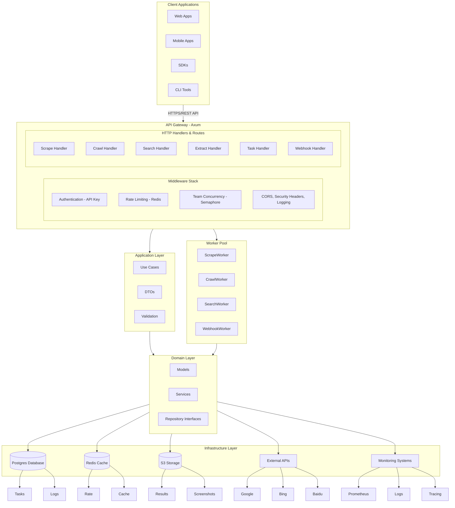
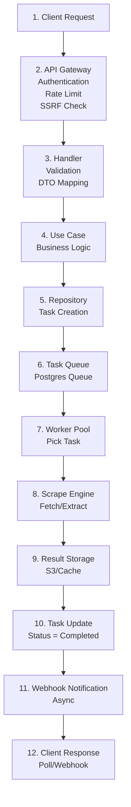
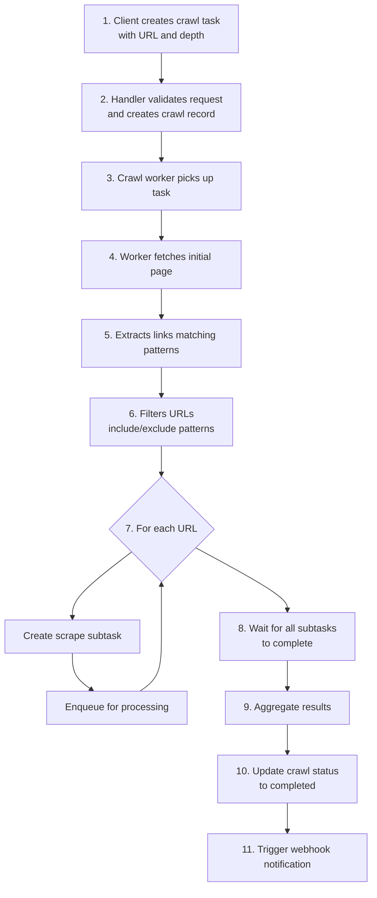
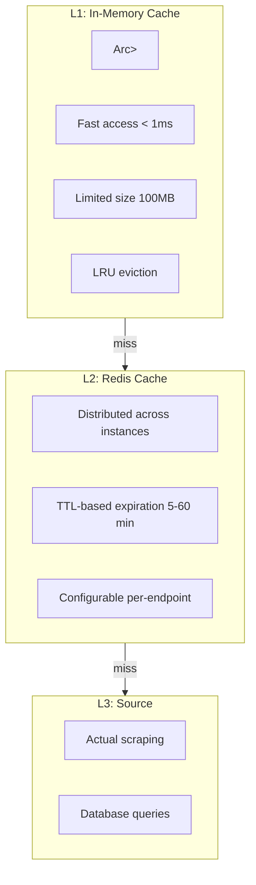
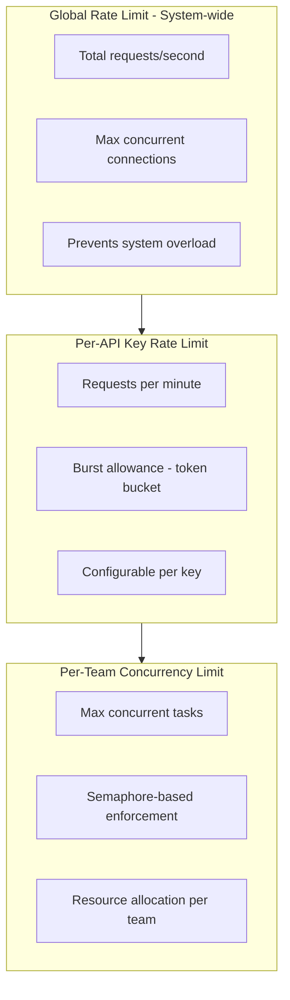
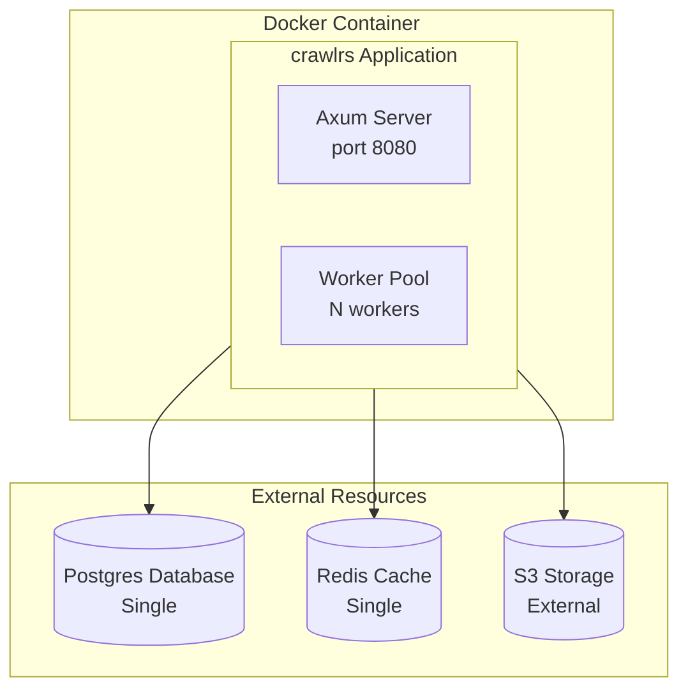
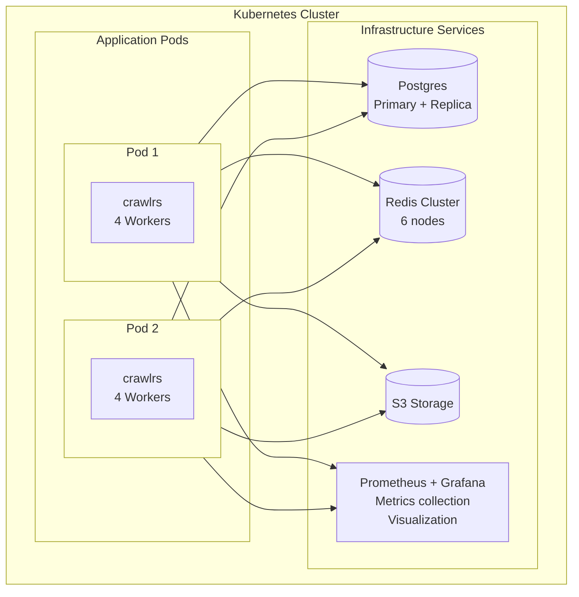
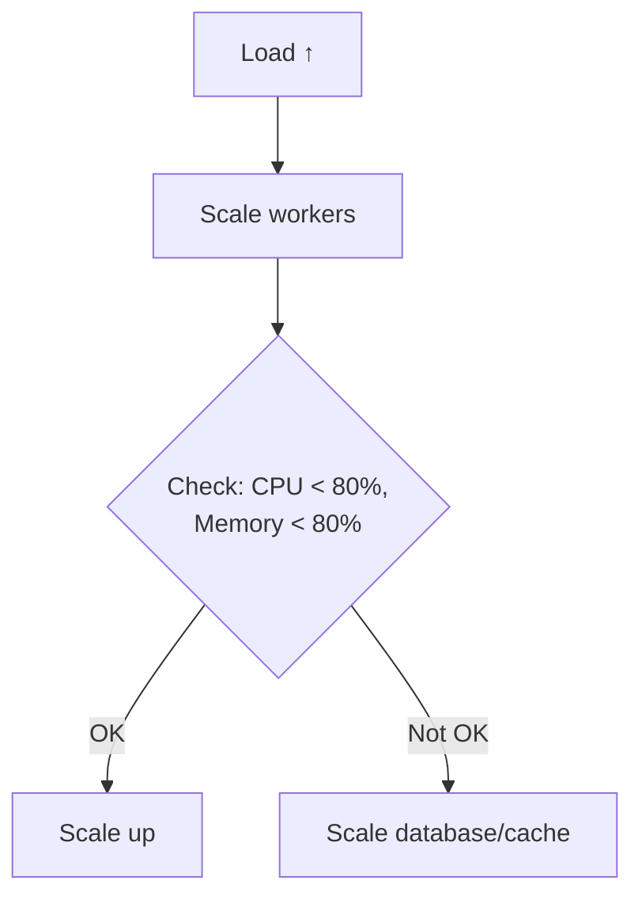

# 🏗️ System Design & Technical Architecture
<div align="center">


**Version:** 0.1.0 | **Last Updated:** 2025-01-15 | **Author:** Kirky.X

</div>

---

## 📖 Table of Contents

- [Overview](#overview)
- [Architectural Principles](#architectural-principles)
- [System Architecture](#system-architecture)
- [Layer Architecture](#layer-architecture)
- [Core Components](#core-components)
  - [Presentation Layer](#presentation-layer)
  - [Application Layer](#application-layer)
  - [Domain Layer](#domain-layer)
  - [Infrastructure Layer](#infrastructure-layer)
- [Data Flow](#data-flow)
- [Crawling Engines](#crawling-engines)
- [Queue System](#queue-system)
- [Caching Strategy](#caching-strategy)
- [Rate Limiting](#rate-limiting)
- [Security Model](#security-model)
- [Deployment Architecture](#deployment-architecture)
- [Scalability Considerations](#scalability-considerations)
- [Future Enhancements](#future-enhancements)

---

## Overview

crawlrs is built using **Domain-Driven Design (DDD)** principles with a clean, layered architecture. The system is designed for high performance, scalability, and maintainability.

### Key Design Goals

1. **Performance** - 3-5x higher throughput than Node.js alternatives
2. **Scalability** - Horizontal scaling capabilities
3. **Type Safety** - Leverage Rust's type system for compile-time safety
4. **Flexibility** - Plugin-based architecture for engines and extensions
5. **Observability** - Built-in metrics, tracing, and logging

---

## Architectural Principles

### 1. Separation of Concerns

Each layer has a specific responsibility:
- **Presentation** - HTTP request/response handling
- **Application** - Use cases and business workflows
- **Domain** - Core business logic and entities
- **Infrastructure** - External integrations

### 2. Dependency Inversion

High-level modules depend on abstractions (traits), not concrete implementations:

```rust
// Domain defines interface
trait TaskRepository: Send + Sync {
    async fn create(&self, task: Task) -> Result<Task>;
}

// Infrastructure provides implementation
struct TaskRepositoryImpl {
    db: Arc<DbConnection>
}

impl TaskRepository for TaskRepositoryImpl { ... }
```

### 3. Single Responsibility

Each component has one reason to change:
- `ScrapeWorker` - Only handles scrape task execution
- `RateLimitingService` - Only manages rate limits
- `WebhookService` - Only handles webhook delivery

### 4. Open/Closed Principle

System is open for extension, closed for modification:
- Add new scraping engines by implementing `ScraperEngine` trait
- Add new search engines by implementing `SearchEngine` trait
- Add new storage backends by implementing `StorageRepository` trait

---

## System Architecture

<!--
┌─────────────────────────────────────────────────────────────────────────────┐
│                           Client Applications                          │
│         (Web Apps, Mobile Apps, SDKs, CLI Tools)                  │
└──────────────────────────────────┬──────────────────────────────────────────┘
                                │ HTTPS/REST API
                                ▼
┌─────────────────────────────────────────────────────────────────────────────┐
│                    API Gateway (Axum)                                │
│  ┌──────────────────────────────────────────────────────────────────────┐  │
│  │  Middleware Stack                                             │  │
│  │  - Authentication (API Key)                                    │  │
│  │  - Rate Limiting (Redis)                                       │  │
│  │  - Team Concurrency (Semaphore)                                 │  │
│  │  - CORS, Security Headers, Logging                              │  │
│  └──────────────────────────────────────────────────────────────────────┘  │
│  ┌──────────────────────────────────────────────────────────────────────┐  │
│  │  HTTP Handlers & Routes                                         │  │
│  │  - Scrape Handler  - Crawl Handler  - Search Handler              │  │
│  │  - Extract Handler  - Task Handler  - Webhook Handler           │  │
│  └──────────────────────────────────────────────────────────────────────┘  │
└──────────────────────────────────┬──────────────────────────────────────────┘
                                │
               ┌────────────────┴────────────────┐
               ▼                                 ▼
┌─────────────────────────┐     ┌─────────────────────────┐
│   Application Layer   │     │   Worker Pool         │
│  - Use Cases         │     │  - ScrapeWorker       │
│  - DTOs             │     │  - CrawlWorker       │
│  - Validation        │     │  - SearchWorker      │
└──────────┬──────────┘     │  - WebhookWorker     │
           │                └──────────┬──────────┘
           ▼                           │
┌─────────────────────────┐            │
│    Domain Layer       │            │
│  - Models            │            │
│  - Services          │            │
│  - Repository       │            │
│    Interfaces       │            │
└──────────┬──────────┘            │
           │                       │
           │  ┌────────────────────┼────────────────────┐
           │  │                    │                    │
           ▼  ▼                    ▼                    ▼
     ┌──────────┐         ┌──────────┐         ┌──────────┐
     │ Postgres │         │  Redis   │         │   S3     │
     │ Database │         │  Cache   │         │  Storage  │
     │  - Tasks │         │  - Rate  │         │ - Results │
     │  - Logs  │         │  - Cache │         │ - Screenshots│
     └──────────┘         └──────────┘         └──────────┘
            │                    │                    │
            └────────────────────┼────────────────────┘
                                │
                       ┌──────────┴──────────┐
                       ▼                     ▼
               ┌─────────────┐     ┌─────────────┐
               │  External   │     │  Monitoring │
               │  APIs       │     │  Systems    │
               │  - Google   │     │  - Prometheus│
               │  - Bing     │     │  - Logs     │
               │  - Baidu    │     │  - Tracing  │
               └─────────────┘     └─────────────┘
-->




---

## Layer Architecture

### Presentation Layer

**Location:** `src/presentation/`

**Responsibilities:**
- HTTP request/response handling
- Request validation
- Response formatting
- Middleware implementation

**Components:**

```
presentation/
├── handlers/          # HTTP endpoint handlers
│   ├── scrape_handler.rs
│   ├── crawl_handler.rs
│   ├── search_handler.rs
│   ├── extract_handler.rs
│   ├── task_handler.rs
│   ├── webhook_handler.rs
│   ├── team_handler.rs
│   ├── audit_handler.rs
│   └── metrics_handler.rs
├── routes/            # Route definitions
│   ├── scrape.rs
│   ├── crawl.rs
│   ├── task.rs
│   └── mod.rs
├── middleware/        # HTTP middleware
│   ├── auth_middleware.rs
│   ├── rate_limit_middleware.rs
│   ├── team_semaphore_middleware.rs
│   ├── security_headers_middleware.rs
│   └── scope_validation.rs
└── extractors/       # Request extractors
    └── team_id.rs
```

**Key Responsibilities:**

1. **Authentication Middleware**
   - Validates API keys
   - Extracts team ID
   - Checks scopes

2. **Rate Limiting Middleware**
   - Enforces per-key rate limits
   - Tracks concurrent requests
   - Returns 429 when limits exceeded

3. **Team Semaphore Middleware**
   - Enforces per-team concurrency limits
   - Prevents resource exhaustion

4. **Handlers**
   - Map HTTP requests to use cases
   - Handle validation errors
   - Format responses

---

### Application Layer

**Location:** `src/application/`

**Responsibilities:**
- Use case orchestration
- DTO definitions
- Request/response transformation
- Business workflow coordination

**Components:**

```
application/
├── use_cases/         # Business use cases
│   ├── scrape_use_case.rs
│   ├── crawl_use_case.rs
│   ├── create_scrape.rs
│   └── mod.rs
└── dto/               # Data Transfer Objects
    ├── scrape_request.rs
    ├── scrape_response.rs
    ├── crawl_request.rs
    ├── crawl_response.rs
    ├── search_request.rs
    ├── extract_request.rs
    ├── task_query_request.rs
    └── mod.rs
```

**Key Use Cases:**

1. **CreateScrape**
   - Validates scrape request
   - Checks rate limits
   - Creates task
   - Enqueues for processing
   - Returns task ID

2. **CreateCrawl**
   - Validates crawl request
   - Creates crawl task with depth/patterns
   - Enqueues for worker pool
   - Returns task ID

3. **ExecuteSearch**
   - Validates search parameters
   - Selects search engine
   - Executes search
   - Deduplicates results
   - Returns formatted results

---

### Domain Layer

**Location:** `src/domain/`

**Responsibilities:**
- Core business entities
- Business rules
- Repository interfaces
- Domain services

**Components:**

```
domain/
├── models/            # Domain entities
│   ├── task.rs
│   ├── crawl.rs
│   ├── scrape_result.rs
│   ├── webhook_event.rs
│   ├── api_key.rs
│   └── mod.rs
├── repositories/      # Repository interfaces
│   ├── task_repository.rs
│   ├── crawl_repository.rs
│   ├── scrape_result_repository.rs
│   ├── storage_repository.rs
│   ├── webhook_repository.rs
│   └── mod.rs
├── services/          # Domain services
│   ├── rate_limiting_service.rs
│   ├── extraction_service.rs
│   ├── team_service.rs
│   └── mod.rs
├── auth/             # Authentication models
│   └── mod.rs
├── use_cases/         # Domain use cases
│   └── mod.rs
└── search/           # Search domain models
    └── mod.rs
```

**Core Domain Entities:**

**Task Entity:**
```rust
pub struct Task {
    pub id: Uuid,
    pub team_id: Uuid,
    pub api_key_id: Uuid,
    pub task_type: TaskType,
    pub status: TaskStatus,
    pub url: String,
    pub payload: Value,
    pub result: Option<Value>,
    pub error: Option<String>,
    pub created_at: DateTime<Utc>,
    pub started_at: Option<DateTime<Utc>>,
    pub completed_at: Option<DateTime<Utc>>,
    pub credits_used: u32,
}
```

**Task Types:**
- `Scrape` - Single page scrape
- `Crawl` - Multi-page crawl
- `Search` - Search engine query
- `Extract` - Data extraction

**Task Statuses:**
- `Pending` - Created, waiting for worker
- `Running` - Being processed by worker
- `Completed` - Successfully completed
- `Failed` - Failed with error
- `Cancelled` - Cancelled by user

**Repository Interfaces:**

```rust
#[async_trait]
pub trait TaskRepository: Send + Sync {
    async fn create(&self, task: Task) -> Result<Task>;
    async fn find_by_id(&self, id: Uuid) -> Result<Option<Task>>;
    async fn update_status(&self, id: Uuid, status: TaskStatus) -> Result<()>;
    async fn update_result(&self, id: Uuid, result: Value) -> Result<()>;
    async fn find_by_team(
        &self,
        team_id: Uuid,
        filters: TaskFilters,
    ) -> Result<Vec<Task>>;
}
```

---

### Infrastructure Layer

**Location:** `src/infrastructure/`

**Responsibilities:**
- External service implementations
- Database access
- Cache management
- Storage integration
- External API clients

**Components:**

```
infrastructure/
├── database/          # Database setup
│   └── connection.rs
├── repositories/      # Repository implementations
│   ├── task_repo_impl.rs
│   ├── crawl_repo_impl.rs
│   ├── scrape_result_repo_impl.rs
│   ├── credits_repo_impl.rs
│   ├── webhook_repo_impl.rs
│   ├── webhook_event_repo_impl.rs
│   ├── database_geo_restriction_repo.rs
│   └── mod.rs
├── cache/            # Cache implementations
│   └── redis_client.rs
├── storage/          # Storage implementations
│   └── s3_storage.rs
└── services/         # Infrastructure services
    ├── rate_limiting_service_impl.rs
    └── webhook_service_impl.rs
```

**Database Layer:**

**Technology:**
- **PostgreSQL** (default) - Production-grade RDBMS
- **SQLite** (optional) - Embedded database for development

**ORM:** Sea-ORM
- Type-safe database access
- Migration management
- Query builder

**Key Tables:**

| Table | Purpose |
|-------|---------|
| `tasks` | Task records |
| `crawls` | Crawl configurations |
| `scrape_results` | Scrape results |
| `api_keys` | API key management |
| `webhooks` | Webhook configurations |
| `webhook_events` | Webhook event logs |
| `audit_logs` | API access logs |
| `team_geo_restrictions` | Geographic restrictions |

**Cache Layer:**

**Technology:** Redis

**Use Cases:**
- Rate limiting storage
- Response caching (TTL-based)
- Session management
- Distributed locks

**Storage Layer:**

**Technology:** AWS S3 (compatible)

**Stored Data:**
- Scrape results (HTML, Markdown)
- Screenshots (PNG/JPEG)
- Large payloads
- Task artifacts

---

## Core Components

### Presentation Layer

**Router:** Axum
- Async web framework built on Tokio
- Type-safe routing
- Efficient middleware stack

**Handler Flow:**

```rust
pub async fn create_scrape(
    Extension(queue): Extension<Arc<dyn TaskQueue>>,
    Extension(redis_client): Extension<Arc<RedisClient>>,
    Extension(rate_limiting_service): Extension<Arc<dyn RateLimitingService>>,
    Extension(auth_state): Extension<AuthState>,
    Json(payload): Json<ScrapeRequestDto>,
) -> impl IntoResponse {
    // 1. Validate request
    // 2. Check rate limits
    // 3. Check SSRF protection
    // 4. Create task in database
    // 5. Enqueue for processing
    // 6. Return task ID
}
```

**Middleware Stack:**

1. **Security Headers**
   - X-Content-Type-Options
   - X-Frame-Options
   - CSP headers

2. **CORS**
   - Configurable origins
   - Supported methods/headers
   - Preflight handling

3. **Authentication**
   - API key validation
   - Team ID extraction
   - Scope checking

4. **Rate Limiting**
   - Request counting
   - Concurrent request tracking
   - 429 responses

5. **Team Semaphore**
   - Per-team concurrency control
   - Wait/semaphore acquisition
   - Resource protection

---

### Application Layer

**Use Case Pattern:**

```rust
pub struct CreateScrapeUseCase<R, Q, C> {
    task_repo: Arc<R>,
    queue: Arc<Q>,
    cache: Arc<C>,
}

impl<R, Q, C> CreateScrapeUseCase<R, Q, C>
where
    R: TaskRepository + Send + Sync,
    Q: TaskQueue + Send + Sync,
    C: CacheClient + Send + Sync,
{
    pub async fn execute(&self, request: ScrapeRequestDto) -> Result<ScrapeResponseDto> {
        // 1. Validate request
        // 2. Check rate limits
        // 3. Check cache
        // 4. Create task
        // 5. Enqueue
        // 6. Return response
    }
}
```

---

### Domain Layer

**Service Layer:**

**RateLimitingService:**
```rust
#[async_trait]
pub trait RateLimitingService: Send + Sync {
    async fn check_rate_limit(
        &self,
        api_key: &str,
        endpoint: &str,
    ) -> Result<RateLimitResult>;

    async fn record_request(
        &self,
        api_key: &str,
        endpoint: &str,
    ) -> Result<()>;

    async fn record_completion(
        &self,
        api_key: &str,
        endpoint: &str,
    ) -> Result<()>;
}
```

**ExtractionService:**
- CSS selector based extraction
- Regex-based extraction
- JSON path extraction
- Custom extraction rules

---

### Infrastructure Layer

**Database Connection Pool:**

```rust
pub async fn establish_connection(
    url: &str,
    max_connections: u32,
) -> Result<DatabaseConnection> {
    let pool = SqlxPoolOptions::new()
        .max_connections(max_connections)
        .connect(url)
        .await?;

    Ok(DatabaseConnection { pool })
}
```

**Redis Client:**

```rust
pub struct RedisClient {
    client: redis::Client,
    pool: Arc<Pool>,
}

impl RedisClient {
    pub async fn get(&self, key: &str) -> Result<Option<String>>;
    pub async fn set(&self, key: &str, value: &str, ttl: u64) -> Result<()>;
    pub async fn increment(&self, key: &str) -> Result<i64>;
}
```

---

## Data Flow

### Scrape Request Flow

<!--
1. Client Request
   ↓
2. API Gateway (Authentication, Rate Limit, SSRF Check)
   ↓
3. Handler (Validation, DTO Mapping)
   ↓
4. Use Case (Business Logic)
   ↓
5. Repository (Task Creation)
   ↓
6. Task Queue (Postgres Queue)
   ↓
7. Worker Pool (Pick Task)
   ↓
8. Scrape Engine (Fetch/Extract)
   ↓
9. Result Storage (S3/Cache)
   ↓
10. Task Update (Status = Completed)
   ↓
11. Webhook Notification (Async)
   ↓
12. Client Response (Poll/Webhook)
-->




### Crawl Request Flow

<!--
1. Client creates crawl task with URL and depth
   ↓
2. Handler validates request and creates crawl record
   ↓
3. Crawl worker picks up task
   ↓
4. Worker fetches initial page
   ↓
5. Extracts links matching patterns
   ↓
6. Filters URLs (include/exclude patterns)
   ↓
7. For each URL:
   - Create scrape subtask
   - Enqueue for processing
   ↓
8. Wait for all subtasks to complete
   ↓
9. Aggregate results
   ↓
10. Update crawl status to completed
   ↓
11. Trigger webhook notification
-->




---

## Crawling Engines

### Engine Architecture

```rust
#[async_trait]
pub trait ScraperEngine: Send + Sync {
    async fn scrape(&self, request: ScrapeRequest) -> Result<ScrapeResult>;

    async fn scrape_with_actions(
        &self,
        request: ScrapeRequest,
        actions: Vec<ScrapeAction>,
    ) -> Result<ScrapeResult>;

    fn supports_feature(&self, feature: EngineFeature) -> bool;
}
```

### Engine Router

```rust
pub struct EngineRouter {
    reqwest_engine: ReqwestEngine,
    #[cfg(feature = "engine-playwright")]
    playwright_engine: PlaywrightEngine,
    #[cfg(feature = "engine-fire-cdp")]
    fire_cdp_engine: FireEngineCdp,
}

impl EngineRouter {
    pub async fn route(&self, request: ScrapeRequest) -> Result<ScrapeResult> {
        match request.options.engine_type {
            EngineType::Reqwest => self.reqwest_engine.scrape(request).await,
            EngineType::Playwright => self.playwright_engine.scrape(request).await,
            EngineType::FireCdp => self.fire_cdp_engine.scrape(request).await,
        }
    }
}
```

### Engine Types

#### 1. Reqwest Engine

**Use Cases:**
- Static HTML pages
- API responses
- JSON/XML data
- Fast scraping without JS

**Features:**
- HTTP/2 support
- TLS 1.2/1.3
- Cookie handling
- Custom headers
- Proxy support

**Pros:**
- Fastest performance
- Lowest resource usage
- No browser overhead

**Cons:**
- No JavaScript execution
- Limited dynamic content support

#### 2. Playwright Engine

**Use Cases:**
- Single Page Applications (SPAs)
- JavaScript-heavy sites
- Sites requiring interactions
- Screenshots/PDFs

**Features:**
- Full JavaScript execution
- Page interactions (click, scroll, input)
- Screenshots and PDFs
- Network interception

**Pros:**
- Full browser capabilities
- Renders dynamic content
- Can handle complex interactions

**Cons:**
- Higher resource usage
- Slower than HTTP client
- Requires Chromium installation

#### 3. Fire Engine (Planned)

**Use Cases:**
- Anti-bot protected sites
- Sites with advanced detection
- High-anonymity requirements

**Features:**
- TLS fingerprinting
- CDP (Chrome DevTools Protocol)
- Advanced proxy rotation
- Browser fingerprinting

---

## Queue System

### Architecture

**Technology:** Postgres NuQ (Native Queue)

**Why Postgres Queue?**
- No external queue dependency
- ACID guarantees
- Strong consistency
- Already have Postgres

**Queue Schema:**

```sql
CREATE TABLE task_queue (
    id BIGSERIAL PRIMARY KEY,
    task_id UUID NOT NULL,
    task_type VARCHAR(50) NOT NULL,
    priority INTEGER DEFAULT 0,
    team_id UUID NOT NULL,
    created_at TIMESTAMP DEFAULT NOW(),
    locked_at TIMESTAMP,
    locked_by VARCHAR(255),
    INDEX idx_priority_created (priority, created_at),
    INDEX idx_team (team_id)
);
```

**Queue Operations:**

```sql
-- Enqueue (INSERT)
INSERT INTO task_queue (task_id, task_type, priority, team_id)
VALUES ($1, $2, $3, $4);

-- Dequeue (FOR UPDATE SKIP LOCKED)
SELECT * FROM task_queue
WHERE locked_at IS NULL
ORDER BY priority ASC, created_at ASC
LIMIT 1
FOR UPDATE SKIP LOCKED;

-- Lock (UPDATE)
UPDATE task_queue
SET locked_at = NOW(), locked_by = $1
WHERE id = $2;

-- Complete (DELETE)
DELETE FROM task_queue WHERE id = $1;
```

**Worker Pool Management:**

```rust
pub struct WorkerManager {
    workers: Vec<Arc<dyn AbstractWorker>>,
    queue: Arc<dyn TaskQueue>,
    shutdown_tx: broadcast::Sender<()>,
}

impl WorkerManager {
    pub async fn start(&self) -> Result<()> {
        // Start multiple workers
        for worker in &self.workers {
            worker.start().await?;
        }
        Ok(())
    }

    pub async fn shutdown(&self) -> Result<()> {
        // Signal all workers to shutdown
        self.shutdown_tx.send(())?;
        // Wait for graceful shutdown
        Ok(())
    }
}
```

---

## Caching Strategy

### Cache Layers

<!--
┌─────────────────────────────────────────────────────┐
│           L1: In-Memory Cache                 │
│         (Arc<Mutex<HashMap>>)               │
│  - Fast access (< 1ms)                       │
│  - Limited size (100MB)                       │
│  - LRU eviction                              │
└──────────────────┬──────────────────────────────┘
                    │ (miss)
                    ▼
┌─────────────────────────────────────────────────────┐
│           L2: Redis Cache                      │
│  - Distributed across instances                 │
│  - TTL-based expiration (5-60 min)            │
│  - Configurable per-endpoint                  │
└──────────────────┬──────────────────────────────┘
                    │ (miss)
                    ▼
┌─────────────────────────────────────────────────────┐
│           L3: Source (Engine/Database)        │
│  - Actual scraping                            │
│  - Database queries                           │
└─────────────────────────────────────────────────────┘
-->




### Cache Keys

**Scrape Result Cache:**
```
scrape:{task_id}:{hash(url+options)}
TTL: 1 hour
```

**Search Result Cache:**
```
search:{engine}:{hash(query+options)}
TTL: 30 minutes
```

**Rate Limit Cache:**
```
ratelimit:{api_key}:{endpoint}
TTL: 1 minute
```

**Concurrency Cache:**
```
concurrent:{team_id}
TTL: No expiration (manual decrement)
```

### Cache Invalidation

- **Time-based TTL** - Automatic expiration
- **Manual invalidation** - On cache config changes
- **Write-through** - Update cache on write
- **Write-back** - Batch updates (rare)

---

## Rate Limiting

### Multi-Level Limiting

<!--
┌─────────────────────────────────────────────────────┐
│        Global Rate Limit (System-wide)           │
│  - Total requests/second                        │
│  - Max concurrent connections                   │
│  - Prevents system overload                    │
└──────────────────┬──────────────────────────────┘
                    │
                    ▼
┌─────────────────────────────────────────────────────┐
│       Per-API Key Rate Limit                     │
│  - Requests per minute                         │
│  - Burst allowance (token bucket)               │
│  - Configurable per key                       │
└──────────────────┬──────────────────────────────┘
                    │
                    ▼
┌─────────────────────────────────────────────────────┐
│      Per-Team Concurrency Limit                 │
│  - Max concurrent tasks                        │
│  - Semaphore-based enforcement                 │
│  - Resource allocation per team               │
└─────────────────────────────────────────────────────┘
-->




### Token Bucket Algorithm

```
┌─────────────────────────────────────────────────────┐
│              Token Bucket                       │
│                                             │
│  ┌──────────────────────────────────────┐     │
│  │  Tokens: [||||||||||] (10/10)  │     │
│  └──────────────────────────────────────┘     │
│                                             │
│  Refill Rate: 1 token/second                │
│  Max Tokens: 10                              │
│  Burst: Up to 10 tokens at once             │
└─────────────────────────────────────────────────────┘
```

**Implementation:**

```rust
pub struct TokenBucket {
    capacity: u32,
    tokens: Arc<Mutex<f64>>,
    refill_rate: f64,
    last_refill: Arc<Mutex<Instant>>,
}

impl TokenBucket {
    pub async fn try_consume(&self, tokens: u32) -> Result<()> {
        // 1. Calculate time since last refill
        // 2. Refill tokens based on rate
        // 3. Check if enough tokens available
        // 4. Consume if available, else return error
    }
}
```

### Concurrency Control

```rust
pub struct TeamSemaphore {
    permits: HashMap<Uuid, Arc<Semaphore>>,
    max_concurrent: HashMap<Uuid, usize>,
}

impl TeamSemaphore {
    pub async fn acquire(&self, team_id: Uuid) -> Result<Permit> {
        let semaphore = self.permits.get(&team_id)
            .ok_or_else(|| Error::TeamNotFound)?;

        Ok(semaphore.acquire().await)
    }
}
```

---

## Security Model

### Authentication

**API Key Authentication:**
```rust
pub struct ApiKey {
    pub id: Uuid,
    pub key_hash: String,  // bcrypt hash
    pub team_id: Uuid,
    pub scopes: Vec<ApiKeyScope>,
    pub is_active: bool,
    pub expires_at: Option<DateTime<Utc>>,
}
```

**Authentication Flow:**
1. Extract API key from `Authorization` header
2. Lookup in database
3. Verify bcrypt hash
4. Check if active and not expired
5. Load team ID and scopes
6. Inject into request state

### Authorization

**Scope-based Access Control:**
```rust
pub enum ApiKeyScope {
    Scrape,
    Crawl,
    Search,
    Extract,
    Admin,
}

impl ApiKeyScope {
    pub fn allows(&self, endpoint: &str) -> bool {
        match self {
            ApiKeyScope::Scrape => endpoint.starts_with("/v1/scrape"),
            ApiKeyScope::Crawl => endpoint.starts_with("/v1/crawl"),
            ApiKeyScope::Search => endpoint.starts_with("/v1/search"),
            ApiKeyScope::Extract => endpoint.starts_with("/v1/extract"),
            ApiKeyScope::Admin => true,  // Full access
        }
    }
}
```

### SSRF Protection

**Blocked Patterns:**
- `http://localhost:*`
- `http://127.*`
- `http://10.*`
- `http://192.168.*`
- `http://172.16-31.*`
- `file://*`
- `ftp://*`

**Implementation:**
```rust
pub fn is_internal_url(url: &str) -> bool {
    let parsed = Url::parse(url)
        .map_err(|_| true)?;

    let host = parsed.host_str()
        .ok_or(true)?;

    // Check for internal IP ranges
    is_internal_ip(host)
}
```

### Input Validation

**URL Validation:**
- Must be http:// or https://
- Max length: 2048 characters
- Valid URL format

**Selector Validation:**
- CSS selector syntax validation
- Maximum selector length
- Prevent injection attacks

**Rate Limit Validation:**
- Max sync_wait_ms: 30000
- Max concurrent: 100
- Max requests/minute: 1000

### Audit Logging

**Logged Events:**
- API requests (endpoint, method, timestamp)
- Authentication attempts
- Rate limit violations
- Denied requests (SSRF, invalid key)
- Task lifecycle events

**Audit Log Schema:**
```sql
CREATE TABLE audit_logs (
    id UUID PRIMARY KEY,
    event_type VARCHAR(50),
    timestamp TIMESTAMP NOT NULL,
    api_key_id UUID,
    endpoint VARCHAR(255),
    ip_address INET,
    user_agent TEXT,
    metadata JSONB
);
```

---

## Deployment Architecture

### Single Instance Deployment

<!--
┌─────────────────────────────────────────────────────┐
│              Docker Container                  │
│  ┌──────────────────────────────────────────┐ │
│  │  crawlrs Application                │ │
│  │  - Axum Server (port 8080)      │ │
│  │  - Worker Pool (N workers)        │ │
│  └──────────────┬───────────────────────┘ │
└─────────────────┼───────────────────────────┘
                  │
       ┌──────────┴──────────┬──────────┐
       ▼                     ▼          ▼
┌────────────┐     ┌────────────┐  ┌────────────┐
│ Postgres   │     │   Redis    │  │    S3      │
│ Database   │     │   Cache    │  │  Storage   │
│ (Single)   │     │ (Single)   │  │ (External) │
└────────────┘     └────────────┘  └────────────┘
-->




### Multi-Instance Deployment (Kubernetes)

<!--
┌─────────────────────────────────────────────────────┐
│              Kubernetes Cluster                  │
│                                             │
│  ┌──────────────────┐  ┌──────────────────┐│
│  │  Pod 1         │  │  Pod 2         ││
│  │  - crawlrs     │  │  - crawlrs     ││
│  │  - 4 Workers   │  │  - 4 Workers   ││
│  └────────┬─────────┘  └────────┬─────────┘│
│           │                     │           │
│  ┌────────┴──────────┬────────┴──────────┐│
│  │                 │                 │    │
│  ▼                 ▼                 ▼    ▼
│ ┌────────────┐  ┌────────────┐  ┌────────────┐
│ │ Postgres   │  │   Redis    │  │    S3      │
│ │ (Primary)  │  │   Cluster  │  │  Storage   │
│ │ + Replica  │  │  (6 nodes) │  │            │
│ └────────────┘  └────────────┘  └────────────┘
│                                             │
│  ┌──────────────────────────────────────────┐    │
│  │  Prometheus + Grafana            │    │
│  │  - Metrics collection               │    │
│  │  - Visualization                │    │
│  └──────────────────────────────────────────┘    │
└─────────────────────────────────────────────────────┘
-->




**Deployment Components:**

1. **Application Pods**
   - Horizontal Pod Autoscaler
   - Load balancer (Ingress)
   - Health checks

2. **PostgreSQL Cluster**
   - Primary + Replicas
   - Automatic failover
   - Backups

3. **Redis Cluster**
   - 6 nodes (3 master, 3 replica)
   - Sentinel for failover
   - Cluster mode enabled

4. **S3 Storage**
   - Multi-region replication
   - Lifecycle policies
   - CDN integration

5. **Monitoring**
   - Prometheus scraping
   - Grafana dashboards
   - AlertManager

---

## Scalability Considerations

### Horizontal Scaling

**Stateless Workers:**
- Workers are stateless
- Can scale independently
- No session affinity required

**Shared State:**
- Postgres - Shared database
- Redis - Shared cache
- S3 - Shared storage

**Scaling Strategy:**

<!--
Load ↑ → Scale workers
      ↓
Check: CPU < 80%, Memory < 80%
      ↓
If OK → Scale up
      ↓
If Not OK → Scale database/cache
-->




### Vertical Scaling

**Resource Limits:**
```yaml
resources:
  requests:
    cpu: "500m"
    memory: "512Mi"
  limits:
    cpu: "2000m"
    memory: "2Gi"
```

**Optimization Points:**
- Database connection pooling
- Worker pool sizing
- Cache size tuning
- Rate limit tuning

### Bottleneck Identification

**Monitoring Metrics:**
- Worker queue depth
- Task completion rate
- Average task duration
- Cache hit/miss ratio
- Database query performance

**Scaling Decisions:**
| Metric | Action |
|---------|--------|
| Queue depth > 1000 | Scale workers |
| Cache hit < 50% | Increase cache size |
| DB query time > 100ms | Scale database |
| Memory > 80% | Scale or optimize |
| CPU > 80% | Scale horizontally |

---

## Future Enhancements

### Planned Architecture Improvements

1. **Event-Driven Architecture**
   - Event bus for internal communication
   - Decoupled microservices
   - Better scalability

2. **Service Mesh**
   - Istio for service communication
   - Advanced traffic management
   - Security policies

3. **GraphQL API**
   - Alternative to REST
   - Flexible queries
   - Single endpoint

4. **WebSocket Support**
   - Real-time task updates
   - Push notifications
   - Reduced polling

---

## Documentation

- [API Reference](API_REFERENCE.md)
- [User Guide](USER_GUIDE.md)

---

**Last Updated:** 2025-01-15
