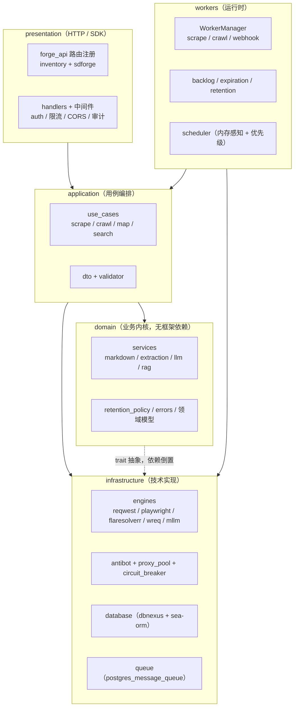

# 业内最佳实践对标报告

> 对标对象：crawlrs 0.2.0-rc.1 vs Firecrawl（SaaS/开源混合）× Crawl4AI（Python 开源）× Crawlee（Node/Python 框架）
> 产出背景：`specmark/changes/bdd-acceptance-hardening`（T014）
> 证据口径：crawlrs 侧每条结论均附**代码路径 + 行号**，可通过 `git blame` 复核；竞品侧结论基于其公开文档（见 §6 数据来源）。

---

## 1. 结论摘要

| 维度 | 结论 | 一句话理由 |
|------|------|-----------|
| 采集引擎 | **领先** | HTTP/浏览器/FlareSolverr/TLS 指纹四引擎 + 竞速与自动升级探测，引擎抽象比三家都完整 |
| 反封锁 | **持平** | 六类 WAF 识别 + 代理轮换池（RoundRobin/粘性）+ 熔断器已齐平 Crawlee 量级；缺 SessionPool 语义 |
| 内容处理 | **持平** | Markdown + 规则提取 + LLM 提取三段齐全，正文抽取走 trafilatura/dom-smoothie 组合 |
| 平台能力 | **领先** | 多租户 + 密钥签发 + Webhook + 审计 + 地理围栏 + 限流，是唯一"开箱即服务平台化"的一家 |
| 编排运维 | **持平** | PG 队列 + 多 worker + 数据保留 + 优雅退出齐备；缺断点续爬与定时重爬 |
| AI 能力 | **持平** | 多模态视觉决策 + LLM 结构化提取 + DRL 自适应爬取，深度够但工程化封装落后 Crawl4AI |

**总评**：架构选型（DDD 四层 + feature 门控 + 依赖抽象）属业内第一梯队，与 Firecrawl 的 TypeScript 服务化路线、Crawlee 的框架化路线相比，是**唯一同时做到「可嵌入（agent-lib 裸面）+ 可服务平台化（platform 面）」双形态**的实现。差距集中在**工程完备度**（批量端点、断点续爬、定时重爬），不在架构层级。

---

## 2. 对标对象与口径说明

| 平台 | 形态 | 本次对标选取的能力面 |
|------|------|---------------------|
| **crawlrs** | Rust 库 + 服务平台双形态（`default = ["platform"]`，`--no-default-features` 可剥离到裸库） | 全量 16 个 `/v1/*` 端点 + 引擎层 + worker 层 |
| **Firecrawl** | 商业 SaaS + 开源 TS 实现 | `/scrape` `/crawl` `/map` `/search` `/extract` `/batch/scrape` 端点族 |
| **Crawl4AI** | Python 开源库 | `arun` / `arun_many` / 自适应爬取 / LLM 结构化提取 / 隐身模式 |
| **Crawlee** | Node/Python 爬虫框架 | `ProxyConfiguration` / `SessionPool` / `RequestQueue` / 自动伸缩 |

口径：**只比能力是否存在与实现深度，不比性能数值**（性能验收需先立基线，属独立变更，见 §5 backlog）。

---

## 3. 六维能力矩阵

### 3.1 采集引擎 —— 领先

| 能力 | crawlrs | Firecrawl | Crawl4AI | Crawlee |
|------|---------|-----------|----------|---------|
| HTTP 引擎 | ✅ `src/engines/client/reqwest.rs` | ✅ | ✅ | ✅ |
| 浏览器引擎 | ✅ `client/playwright.rs`（feature `engine-playwright`） | ✅ Playwright | ✅ Playwright/CDP | ✅ Playwright/Puppeteer |
| 反爬代理引擎 | ✅ `client/flare_solverr.rs`（feature `engine-flaresolverr`） | ❌ | 部分（隐身模式） | ❌ |
| TLS/JA3 指纹引擎 | ✅ `client/wreq_engine.rs`（feature `engine-tls-fingerprint`，Cargo.toml:61） | ❌ | 部分 | ❌ |
| 引擎路由策略 | ✅ 竞速 + 顺序回退 + 选择器：`router/{route_race.rs, route_sequential.rs, engine_selector.rs}` | ❌ 固定策略 | ❌ 固定策略 | ❌ 固定策略 |
| 自动升级探测 | ✅ `upgrade_probe.rs`（判定页面需 JS 渲染后升级浏览器） | 部分 | 部分 | ❌ |

**证据要点**：`Cargo.toml:56-63` 的四个 `engine-*` feature 说明引擎是可裁剪插件，而非硬编码分支；`router/` 三策略将"选哪个引擎"从业务代码里抽出。三家竞品均为"同步 HTTP → 失败则浏览器"的固定两级策略。

### 3.2 反封锁 —— 持平

| 能力 | crawlrs | Firecrawl | Crawl4AI | Crawlee |
|------|---------|-----------|----------|---------|
| WAF/反爬识别 | ✅ 六类：`antibot/patterns.rs:25-39`（Cloudflare / Akamai / PerimeterX / DataDome / Imperva / AWS WAF），判定入口 `antibot/classifier.rs:175` | 部分 | 部分 | ❌ |
| 代理轮换池 | ✅ `engines/proxy_pool.rs:124` `ProxyPool`：RoundRobin `next()`（:202）+ 粘性会话 `sticky()`（:223）+ 失败冷却（`mark_failure` :100）+ HTML/Media 分类 | ✅ 托管代理 | ✅ | ✅ `ProxyConfiguration` |
| 粘性会话绑定 | ✅ `proxy_pool.rs:223` 按 `session_id` 绑定代理 | ✅ | ❌ | ✅ SessionPool |
| 会话健康度驱动的轮换 | ❌ 无错误率统计驱动的会话封禁与轮换 | ✅ | 部分 | ✅ SessionPool 核心能力 |
| 熔断 | ✅ `engines/circuit_breaker.rs:87` | ❌ | ❌ | 部分 |
| 引擎健康监测 | ✅ `engines/health_monitor.rs` | ❌ | ❌ | ❌ |
| 浏览器实例/Tab 池 | ✅ `client/playwright_pool.rs:36` `BrowserPoolConfig` + `client/tab_pool.rs`（LIFO 复用空闲 Page） | ❌ | ✅ | ✅ |
| JS 注入 | ✅ `engines/js_inject/` | 部分 | ✅ | ✅ |

**结论**：代理轮换池已实现（RoundRobin + 粘性 + 冷却 + 分类），**早期提案中"crawlrs 仅单代理透传"的结论已过时**——该能力在 `src/bootstrap/engines.rs:269` 注入、`src/engines/client/reqwest.rs:49` 以 `ProxyProvider` trait 消费。真正缺的是 Crawlee `SessionPool` 的**会话级健康度模型**（错误率/封禁/年龄驱动的轮换与持久化），判"持平"而非"领先"。

### 3.3 内容处理 —— 持平

| 能力 | crawlrs | Firecrawl | Crawl4AI | Crawlee |
|------|---------|-----------|----------|---------|
| HTML → Markdown | ✅ `domain/services/markdown_service.rs:59` `HtmdMarkdownService` | ✅ | ✅ `DefaultMarkdownGenerator` | 部分 |
| 规则提取（CSS/XPath/正则） | ✅ `domain/services/extraction_service.rs:87` + `domain/services/content_extractor/` | ✅ | ✅ | ✅ |
| 正文抽取算法 | ✅ feature `extractors` = `trafilatura` + `dom-smoothie`（Cargo.toml:76） | ✅ | ✅ | 部分 |
| LLM 结构化提取 | ✅ `domain/services/llm/{provider_adapter.rs, vision_adapter.rs, prompt_builder.rs}`（feature `llm` = genai） | ✅ | ✅ | ❌ |
| 后处理管线 | ✅ `workers/markdown_post_processor.rs` | 部分 | ✅ | ❌ |

### 3.4 平台能力 —— 领先

crawlrs 当前注册 16 个 `/v1/*` 端点（`src/presentation/forge_api/`）：

`/v1/scrape`、`/v1/scrape/{id}`、`/v1/crawl`、`/v1/crawl/{id}`、`/v1/crawl/{id}/results`、`/v1/search`、`/v1/extract`、`/v1/map`、`/v1/teams/me`、`/v1/teams/me/usage`、`/v1/teams/geo-restrictions`、`/v1/webhooks`、`/v1/audit/logs`、`/v1/audit/denied`、`/v1/tasks/_query`、`/v1/tasks/_cancel`、`/v1/admin/api-keys`

| 能力 | crawlrs | Firecrawl | Crawl4AI | Crawlee |
|------|---------|-----------|----------|---------|
| 多租户 + 用量计量 | ✅ `teams` + `credits` 表（`check_and_deduct_quota`） | ✅ SaaS 计费 | ❌ 库形态无租户 | ❌ |
| API 密钥签发 | ✅ `/v1/admin/api-keys`（garrison 签发，`<key_id>.<secret>`） | ✅ | ❌ | ❌ |
| Webhook 事件推送 | ✅ `workers/webhook_worker.rs` + Standard Webhooks HMAC 签名 | ✅ | ❌ | ❌ |
| 审计日志 | ✅ `/v1/audit/logs`、`/v1/audit/denied` | 部分 | ❌ | ❌ |
| 地理围栏 | ✅ `/v1/teams/geo-restrictions` + `domain/services/geo_location.rs` | ❌ | ❌ | ❌ |
| 限流 | ✅ `domain/services/rate_limiting_service.rs` | ✅ | ❌ | ✅ |
| 国际化 | ✅ `locales/{en-US,zh-CN}` + `i18n/` | ❌ | ❌ | ❌ |
| 双形态交付（库 / 服务） | ✅ `--no-default-features`（agent-lib 面）vs `platform` 面 | ❌ 仅服务 | ❌ 仅库 | ❌ 仅库 |

**结论**：Firecrawl 是唯一在平台面上同量级的对手，但它是 SaaS 单一形态；crawlrs 的 feature 门控让同一份代码既能嵌进 Agent（裸库面）又能独立部署（平台面），这一点三家都没有。

### 3.5 编排运维 —— 持平

| 能力 | crawlrs | Firecrawl | Crawl4AI | Crawlee |
|------|---------|-----------|----------|---------|
| 任务队列 | ✅ PG 队列 `queue/postgres_message_queue.rs:38`（无外部 MQ 依赖） | ✅ Redis/BullMQ | ❌ 进程内并发 | ✅ RequestQueue |
| 多 worker 并发 | ✅ `workers/manager.rs:100` `WorkerManagerDeps` + 16 个 worker 模块 | ✅ | 部分 | ✅ 自动伸缩 |
| 内存感知调度 | ✅ `workers/scheduler/memory_scheduler.rs` + `priority_queue.rs` | ❌ | ❌ | ✅ |
| 数据保留清理 | ✅ `workers/retention_worker.rs:119`（分批 + 超时 + PG advisory lock 多实例互斥） | ❌ | ❌ | ❌ |
| 优雅退出 | ✅ `workers/shutdown.rs`（宽限期 + 未完成任务回滚） | ❌ | ❌ | ✅ |
| 可观测性 | ✅ `docker/{prometheus,grafana}` + `router_metrics.rs` + `/health` `/ready` `/version` | ✅ | ❌ | 部分 |
| Schema 演进 | ✅ `migrations/001..007`（`006_add_message_queue`、`007_add_retention_indexes`） | ❌ SaaS 内部 | ❌ | ❌ |
| 断点续爬（resume/checkpoint） | ❌ 全库无 `resume`/`checkpoint` | ✅ 部分 | ❌ | ✅ |
| 定时重爬（monitor） | ❌ 无持久化定时任务 | ✅ Firecrawl monitor | ❌ | 部分 |

### 3.6 AI 能力 —— 持平

| 能力 | crawlrs | Firecrawl | Crawl4AI | Crawlee |
|------|---------|-----------|----------|---------|
| 多模态视觉决策 | ✅ `engines/mllm/decision.rs:76` `parse_decision`（滚动/点击等动作），默认 `gemini-2.0-flash`（`mllm/config.rs:18`） | ❌ | 部分 | ❌ |
| LLM 结构化提取 | ✅ `domain/services/llm/`（feature `llm` = genai） | ✅ | ✅ | ❌ |
| 自适应爬取 | ✅ `workers/crawl/adaptive.rs` + `scorers.rs:205` `CompositeScorer` + `frontier.rs:168` | ❌ | ✅ Adaptive Crawling | ❌ |
| 强化学习策略 | ✅ `workers/crawl/drl_policy.rs:194` `DrlPolicy`（ONNX 推理，`HeuristicPolicy` 兜底 :136） | ❌ | ❌ | ❌ |
| 知识图谱 | ✅ `workers/crawl/knowledge_graph.rs` | ❌ | ❌ | ❌ |
| 搜索结果融合 | ✅ `search/rrf.rs:25` `RRFFuser`（RRF）+ `search/dedup.rs` + `search/smart/` | ✅ | ❌ | ❌ |
| RAG 策略 | ✅ `domain/services/rag_strategy.rs` + `relevance_scorer.rs` | 部分 | ❌ | ❌ |

**结论**：模型侧能力 breadth 超过 Crawl4AI（DRL 策略、知识图谱、RRF 融合是独有项），但 Crawl4AI 的**开发者体验**（一行 `arun()` 拿 Markdown + 结构化数据）更好，crawlrs 的 AI 能力散落在多个 feature 门后，需显式开启 `llm`/`engine-mllm`。

---

## 4. 差距分级表

| 差距项 | 分级 | 依据 | 备注 |
|--------|------|------|------|
| `/v1/map` 站点 URL 发现 | ✅ **本变更已实施** | `src/presentation/forge_api/map.rs` + `application/use_cases/map_use_case.rs` | 对齐 Firecrawl `/map`：sitemap 解析 + 索引递归（上限 5）+ 去重 + glob 过滤 + limit |
| 代理轮换池 | ✅ **已存在（非差距）** | `engines/proxy_pool.rs:124` | 提案早期"仅单代理透传"结论**已过时**，本变更核查后修正 |
| 批量抓取（batch scrape） | 🔶 **backlog** | `src/presentation/forge_api/` 无 `/v1/batch*` 端点 | 对标 Firecrawl `/batch/scrape`、Crawl4AI `arun_many`；需任务编排层扩展 |
| SessionPool 语义 | 🔶 **backlog（部分覆盖）** | 粘性绑定已有（`proxy_pool.rs:223`）、浏览器/Tab 池已有；缺会话健康度驱动的轮换与持久化 | 对标 Crawlee `SessionPool` |
| 断点续爬（resume/checkpoint） | 🔶 **backlog** | 全库 grep 无 `resume`/`checkpoint` | 需 crawl 状态落盘 + 重启恢复 |
| 定时重爬（monitor） | 🔶 **backlog** | 无持久化定时调度；`workers/scheduler/` 为内存优先级调度 | 对标 Firecrawl monitor |
| credits 商业化计费 | ⬜ **不适用** | crawlrs 已有 `credits` 计量（每 search/scrape 扣 1） | 售卖与订阅属 SaaS 商业模式，非能力差距 |
| 性能验收（k6 SLO） | ⬜ **独立变更** | `tests/stress/` 有脚本但无基线指标 | 需先立基线再定 SLO |

---

## 5. 架构总评

crawlrs 的分层与门控设计符合当前业内主流的服务化爬虫架构共识：

1. **依赖方向单向**：`presentation → application → domain ← infrastructure`，领域层不反向依赖基础设施（services 全部位于 `src/domain/services/` 而非 `infrastructure/`）。
2. **可裁剪交付**：`Cargo.toml` 的 7 种 feature 组合（`no-default` / `teams` / `auth` / `rate-limit` / `webhook` / `default(platform)` / `full`）由 CI `feature-matrix` job 全量校验，并对 `garrison` 依赖做 presence/absence 断言（`.github/workflows/ci.yml`）。这是 Crawl4AI/Crawlee 这类"库形态"项目不需要、而 Firecrawl 这类"服务形态"项目通常做不到的工程纪律。
3. **测试规模**：`src/` 380 个 Rust 文件约 17.5 万行，内联单元测试约 5700 个；`tests/` 113 个 Rust 测试文件；本变更新增 BDD 验收套件（`tests/acceptance/`，38 场景覆盖 8 个 feature 文件）。对比 Crawlee/Crawl4AI 以集成测试为主、Firecrawl 以 SaaS 灰度为主的策略，crawlrs 的"单元 + 集成 + BDD 三层"在当前体量下是合理的。
4. **可运维性**：PG 作为唯一外部强依赖（队列即数据库），避免 Redis/RabbitMQ 运维面；数据保留、优雅退出、advisory lock 多实例互斥都是"上线级"而非"demo 级"的关注点。



**一句话回答"是否符合业内最佳实践"**：架构分层、依赖倒置、feature 门控、可运维性四项均符合；差距在**产品级工程完备度**（批量端点、断点续爬、定时重爬、SessionPool），这些是排期问题而非架构问题。

---

## 6. 数据来源与复现

- crawlrs 侧证据：`git grep` 本文件引用的路径行号，配合 `git blame` 可追到引入提交。
- Firecrawl：官方文档 `docs.firecrawl.dev`（`/map`、`/batch/scrape`、高级抓取指南端点族）。
- Crawlee：`crawlee.dev/python/docs/guides/session-management`（SessionPool 轮换代理 IP、cookie 与自定义状态）、`ProxyConfiguration`。
- Crawl4AI：`docs.crawl4ai.com`（`arun_many` 批量并发、Adaptive Crawling 自适应爬取、LLM 结构化提取）。
- 复现命令：
  ```bash
  # 端点清单（本报告 §3.4 数据来源）
  grep -rhon '"/v1/[a-z0-9/{}_.-]*"' src/presentation/forge_api/*.rs | sort -u -t: -k2
  # 差距项核查（batch / SessionPool / resume）
  grep -rni "batch\|session_pool\|resume\|checkpoint" src/ --include=*.rs | head
  ```
